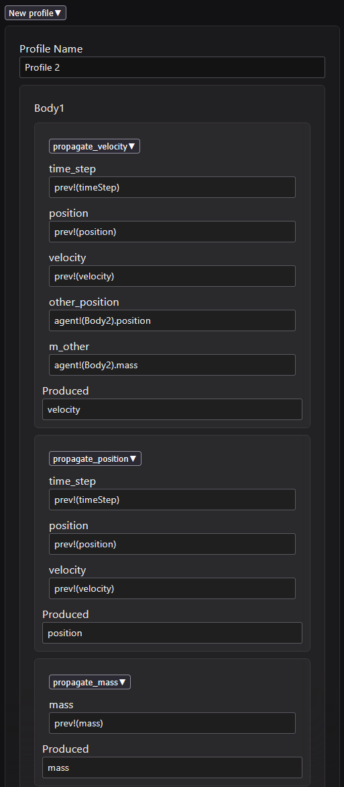
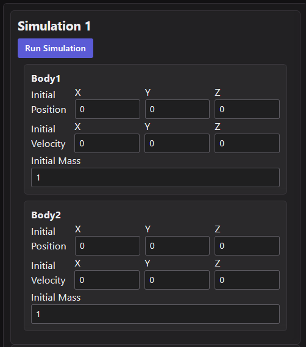

# Gabe Bobbitt: Sedaro Nano Project

## Design

The concept of a "profile" was created, which encapsulates a list of agents, their state managers, and one or more simulations. Profiles were made with the consideration that the system may perform some compilation process when a profile is loaded. For example, the list of state managers could be compiled into a set of GPU operations, allowing each step of a simulation to be reduced to GPU calls. The API is designed for this, separating the loading of a profile and running of simulations into separate calls. Once a profile is loaded, any number of simulations may be run without recompiling.

The backend API is updated with new endpoints:
- GET `/profiles`: Retrieve all saved profiles
- PUT `/profiles/<profile ID>`: Save a profile, also loading it into memory
- POST `/profiles/<profile ID>/load`: Load a profile into memory
- GET `/profiles/<profile ID>/simulations`: Retrieve all simulations associated with a profile
- PUT `/profile/<profile_id>/simulation/<simulation_id>`: Run a simulation, also saving it to database
- GET `/schema/statemanagers`: Retrieve the available state managers along with their inputs and output

## Making profiles

To set up a profile, click "Select a profile > New profile" and add one or more agents. Each agent may be given one or more state managers. The parameters of each state manager are specified as queries, as shown here:

One or more simulations may be associated with a profile, specifying the initial state of each agent:

Profiles and their simulations persist in the database.

## Future Work

The next step would be to compile profiles to simplify the work done during a simulation run. Currently, simulation steps are still interpreted.

A more sophisticated query editor could be added, allowing users to "build" queries for each state manager rather than manually typing.

Some obvious improvements are needed to the frontend:
- Deleting agents and simulations
- Form validation
- Exposing error notifications from the backend
- Styling and layout improvements